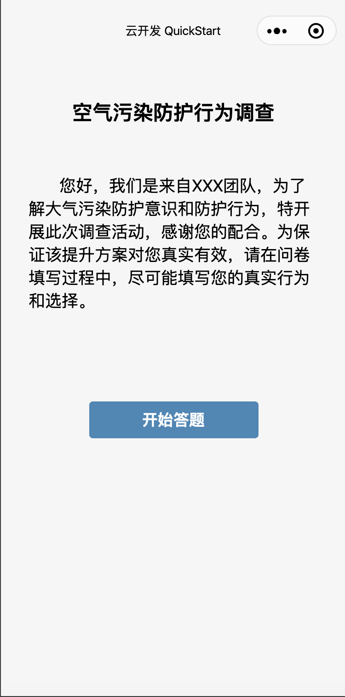
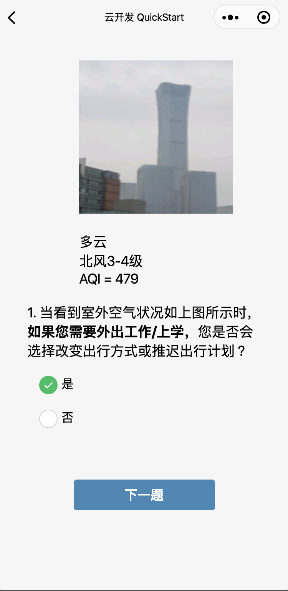
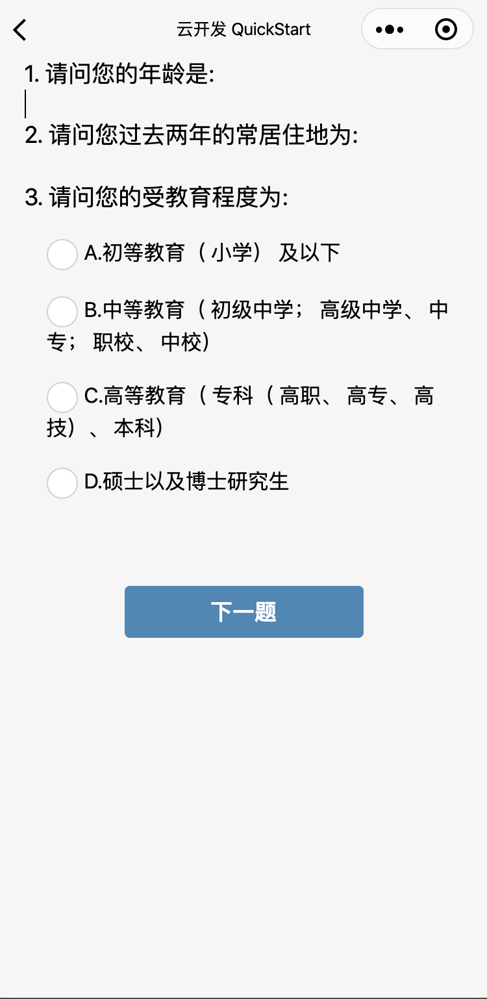

# Wechat MiniProgram Smart Survey
## An light-weight wechat(weixin) miniprogram-based survey implemented with qiniuyun(SevenCowCloud) as backend cloud server, with following features
1. It presents an introduction of the survey and an start button on the first page
2. It ask questions based on randomly generated environment photo associated with specific weather, temperature, wind degree, and AQI(air-quality-index)
3. Different questions can be triggered based on user's answers
4. It also provide a final page for user to input personal info and submit the survey to wechat dev cloud

*survey answers and randomly-generated image id are stored in an array named 'allQA'

## Screen shots of the app are attched below
### Image of intro page 
 
### Image of question page 
 
### Image of personal info page 
 
### Image of submit page 
 
### Image of thankyou page 
 
